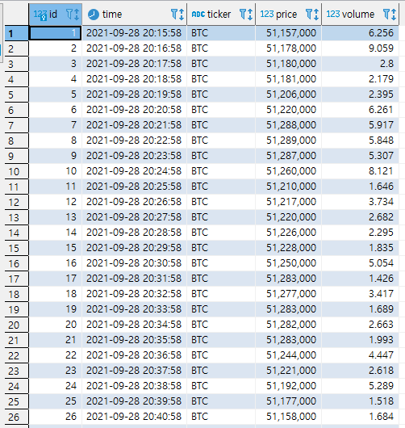
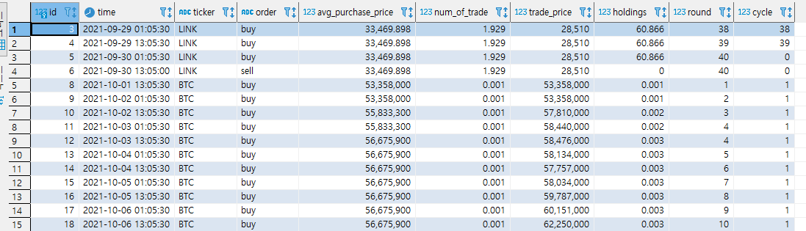

- 개인 프로젝트
- 트레이딩 봇: 2021.02 ~ 2021.03
- 데이터 파이프라인 구축: 2021.09 ~ 2021.10

# 프로젝트 소개

이 프로젝트는 Python과 MySQL을 사용했으며 트레이딩 봇과 데이터 파이프라인 두 가지 구성요소가 있다. 작년 12월 다시 암호화폐 가격이 들썩이고 관심을 받을 때 트레이딩 봇에 관심이 생겨서 직접 만들어보게 됐다. 나의 감정에 흔들리지 않고 일정하게 거래를 하도록 하는 것이 수익률에 큰 도움이 되었다. 그리고 데이터 파이프라인을 만들어보기에 앞서 어떤 데이터를 사용할 지 고민이 많았다. 지속적으로 많은 데이터를 만들어내는 것이 힘들었기 때문이다. 그런데 이전에 만들었던 자동매매 봇이 생각났고 봇의 거래 내역이 만드는 데이터를 사용하면 될 것 같다고 생각하여 프로젝트를 시작했다.

## 1. 업비트 트레이딩 봇

- 정액 분할 매수법으로 투자하도록 설계
    - 보유한 현금을 동일한 금액만큼 40회에 나누어 매수
    - 현금을 모두 소진하면 보유 자산을 모두 매도
    - 정해진 시간에 일정하게 매수하도록 설정
    - 40회가 끝나지 않았더라도 목표 수익률에 도달하면 즉시 전량 매도
- Python의 APScheduler를 사용해 원하는 시간에 해당 작업을 수행하도록 함
    
    ```python
    sched = BackgroundScheduler({'apscheduler.timezone': 'Asia/Seoul'})
    # strategies
    sched.add_job(my_strategy.infinite_bid, 'cron', hour=order_time, minute='5', id="buy_1")
    sched.add_job(my_strategy.sell_make_profit, 'interval', seconds=15, id="sell_1")
    # pipeline
    tickers = args.watch.split()
    sched.add_job(collect_price, 'cron', second='0', args=[tickers], id='collect price')
    sched.add_job(collect_account, 'cron', second='3', id='check account')
    ```
    
- 매수/매도 및 가격 조회 등은 업비트에서 제공하는 API 사용   
- 텔레그램 봇을 통해 거래 내용, 현재가격 등을 메시지로 안내

## 2. 데이터 파이프라인 구축

- Python ORM SQLAlchemy를 사용해 ETL 진행
- 위의 트레이딩 봇이 만드는 가격 정보, 거래 기록 등 주기적으로 발생하는 데이터를 데이터베이스에 저장
- 지정한 코인들의 가격, 나의 자산 정보, 거래 내역을 지속적으로 업데이트하며 데이터베이스에 저장
- API로 불러오는 데이터는 json으로 텍스트로 되어있었고 시간, 숫자, 텍스트 등 적절한 형태로 바꾸어 테이블에 저장





# 어려웠던 점과 해결 방법

- 주식 시장과 달리 암호화폐 시장은 24시간 열려있기 때문에 봇 역시 24시간 실행되어야 한다. 하지만 컴퓨터를 24시간 켜둘 수 없기 때문에 AWS의 EC2를 학생 계정으로 사용했다. ssh를 사용한 원격 접속은 익숙했기 때문에 기본 설정에는 크게 어려움이 없었다.
- 정해진 시간에 지정된 작업을 하도록 하는 방법에는 여러가지 방법이 있었는데 처음에는 리눅스의 'cron'을 사용하려했으나 리눅스에서 초단위를 사용할 수 없었고, 시간 외에도 다양한 argument를 사용했기 때문에 통일감을 주기위해 Python의 패키지 APScheduler를 대신 사용했다.
- 주식이든 코인이든 정해진 매매 기준에 따라 매매하면 수익을 얻을 수 있지만 투자자의 심리상태에 따라 항상 그대로 실천하지 못하는 경우가 대부분이었다. 자동거래를 통해 내가 신경쓰지 않더라도 지속적으로 거래를 할 수 있었고 나의 심리상태에 흔들리지 않았다. 2월부터 4개월간 약 40%의 수익을 얻었다.

# 성과

- API를 처음 사용해 데이터를 받아오는 법을 배울 수 있었다.
- 데이터 파이프라인을 구축하면서 ETL 과정을 진행했다. 평소에 사용하던 Python을 사용해서 조금 더 쉽게 할 수 있었다.
- AWS 기본 세팅과 ssh를 사용한 원격 접속에 더 익숙해질 수 있었다.

---